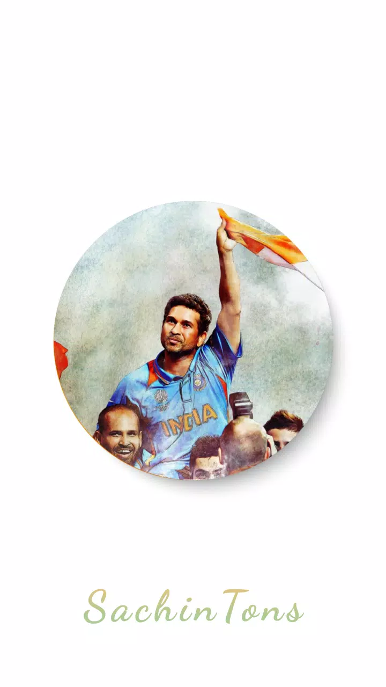
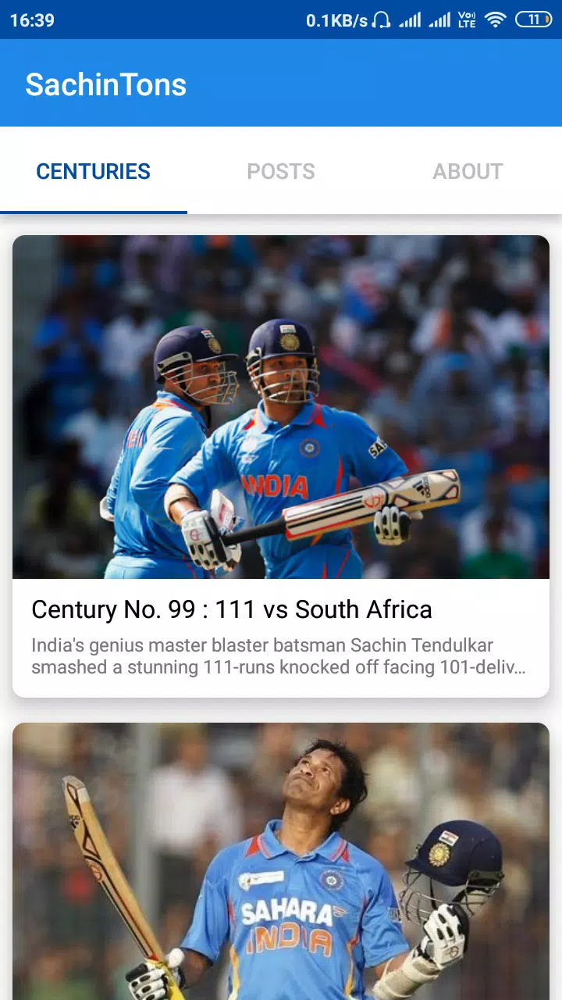
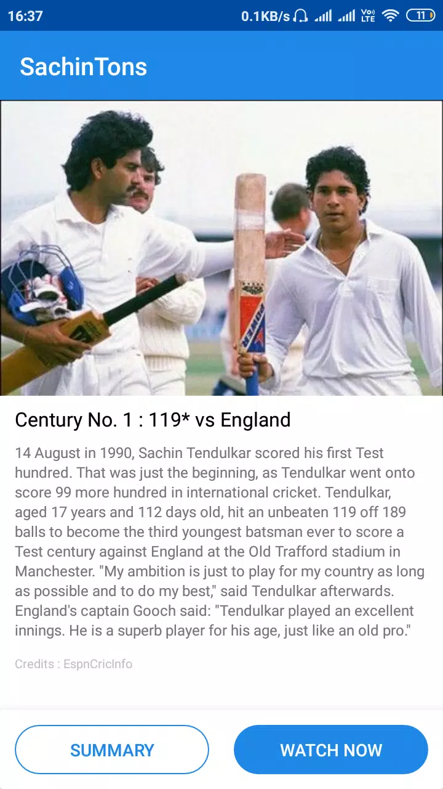
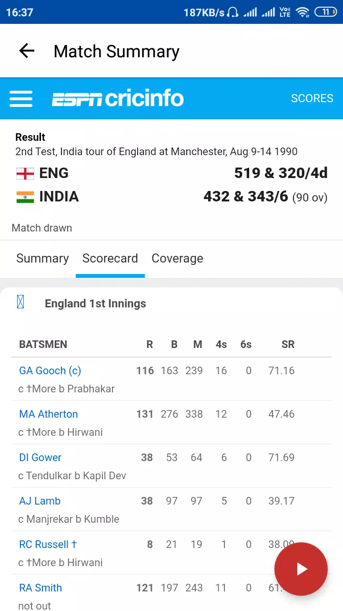
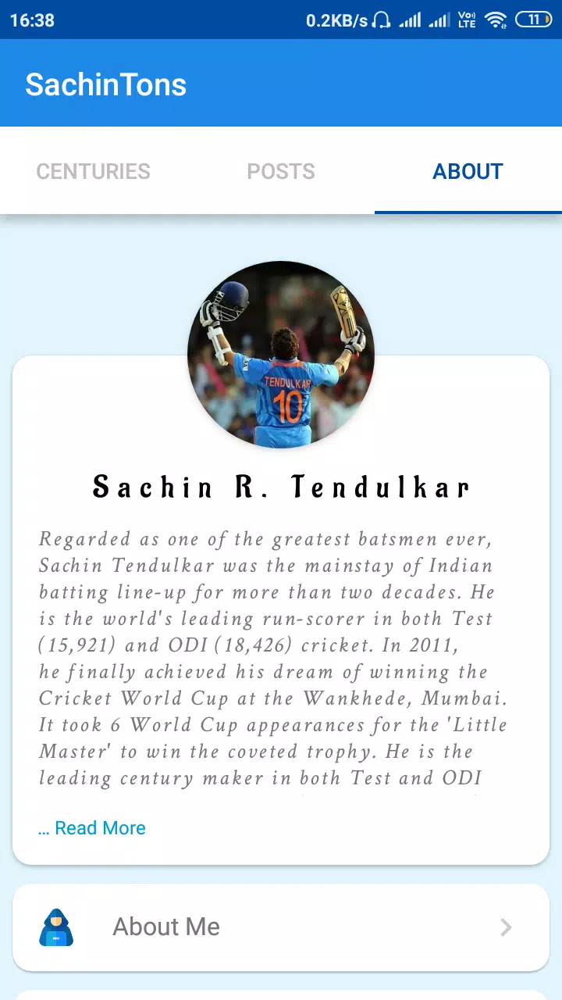

# SachinTons 📱🏏

**SachinTons** is an Android mobile application that celebrates the cricketing legacy of **Sachin Tendulkar** by providing detailed coverage of all his **100 international centuries**. From match summaries and full scorecards to embedded videos, SachinTons is a tribute to the God of Cricket.

## 📥 Download Now

👉 [Get it on Google Play](https://play.google.com/store/apps/details?id=com.adityay.sachintons)

## ✨ Features

- 🏏 Complete list of Sachin Tendulkar’s 100 international centuries
- 📊 Match details including opponent, venue, and result
- 🎥 Video highlights of each century
- ⚡ Smooth and responsive UI for a seamless experience

## 📸 Screenshots

<p>
  
  
  
  
  
   
</p>


## 🛠 Tech Stack

- **Frontend:** Java, Android Studio
- **Backend:** Node.js
- **Media:** YouTube API for video integration

## 🚀 Getting Started

To run this project locally:

1. Clone the repository:
   ```bash
   git clone https://github.com/AdiY2j/SachinTons.git
